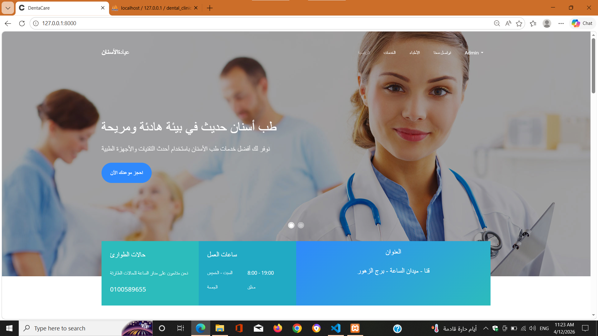
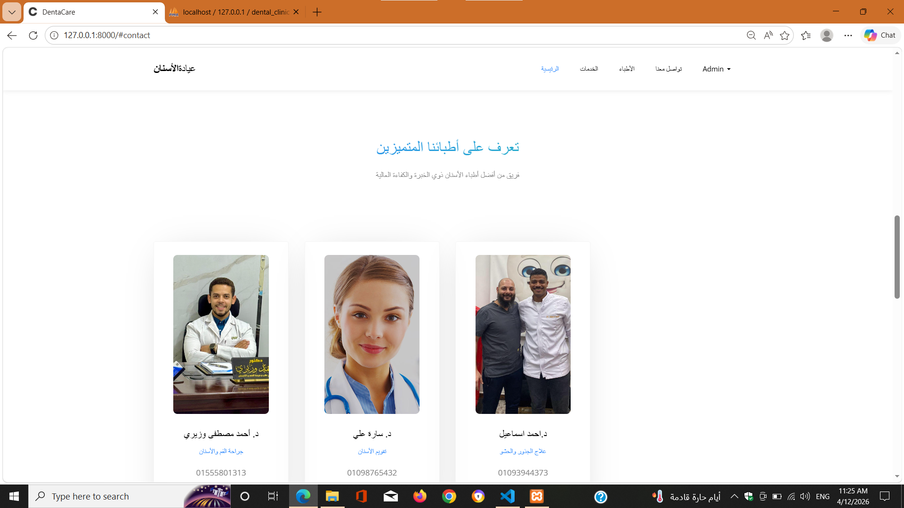
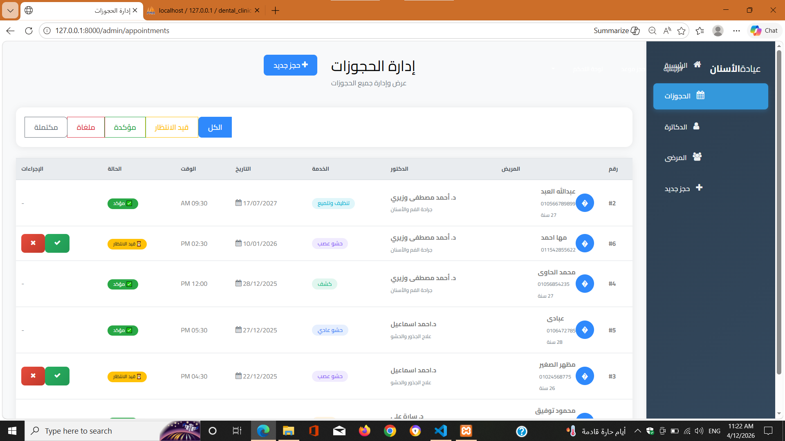
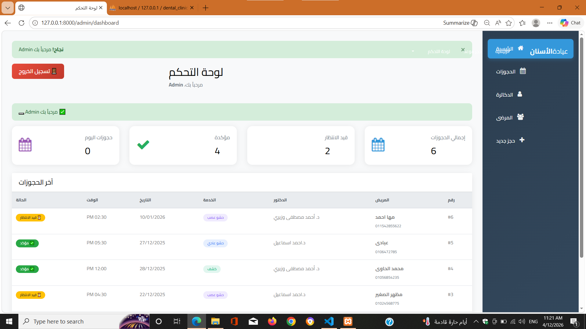

# Dental Clinic Booking System

A complete dental clinic management and appointment booking system built with Laravel.

This system allows patients to book appointments with doctors based on availability, working days, and schedules.

---

## 🚀 Features

- Patient appointment booking system
- Doctor management (Add, edit, delete)
- Doctor schedules and working days
- Availability-based booking system
- Admin dashboard for managing appointments
- Authentication system (Login / Register)

---

## 🛠️ Tech Stack

- PHP
- Laravel
- MySQL
- Blade Template Engine
- Bootstrap

---

## 📸 Screenshots

### Home Page


### Doctors List


### Booking Page


### Dashboard


---

## ⚙️ Installation

```bash
git clone https://github.com/mahmoudtawfik1998/dental-clinic.git
cd dental-clinic
composer install
cp .env.example .env
php artisan key:generate
php artisan migrate
php artisan serve


📌 Project Highlights
Implemented real-world booking logic with doctor availability
Designed a system to prevent double booking
Built dynamic scheduling system for doctors
📬 Contact

Mahmoud Tawfik
Laravel Backend Developer
GitHub: https://github.com/mahmoudtawfik1998
